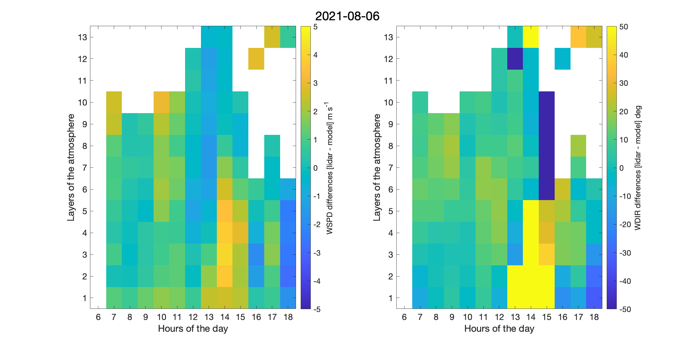
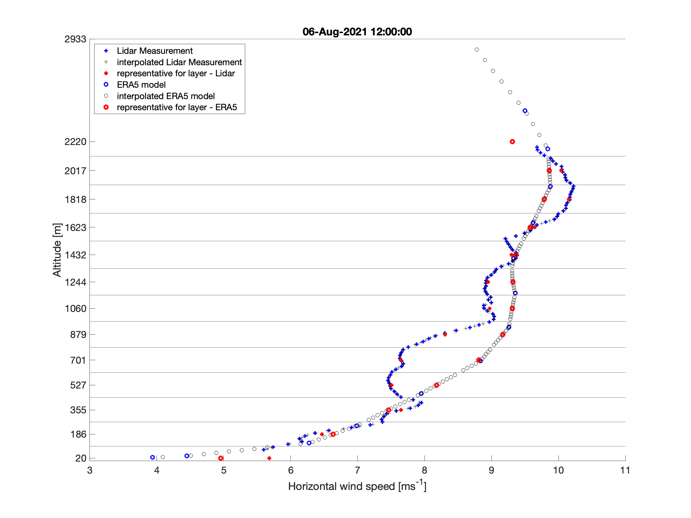
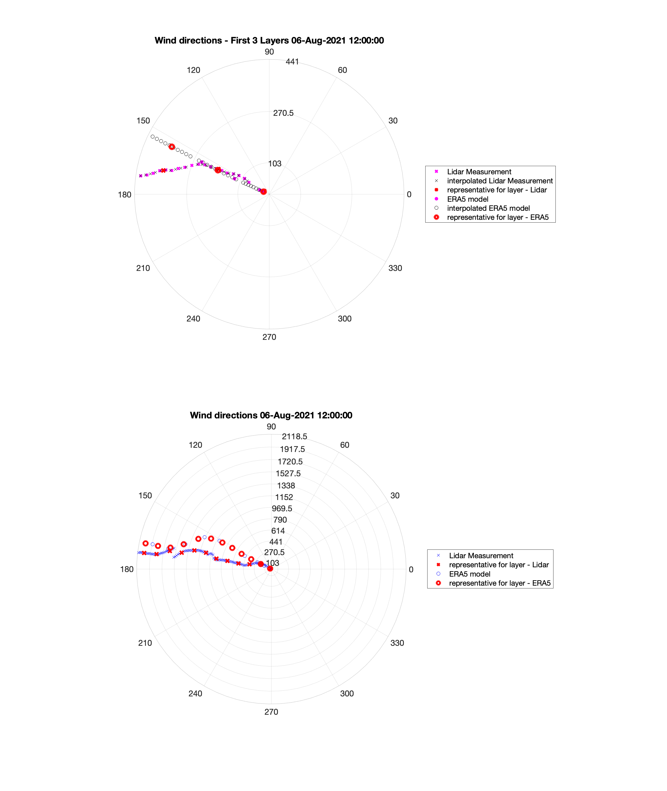

# Wind Error Assessment

Welcome to the Wind Error Assessment project. This repository contains scripts and data for assessing wind measurement errors.

For access to scripts and data locations, as well as a detailed readme for running the framework, please refer to [Run](./RUN.md).

# LiDAR Measurements

The scanning Doppler LiDAR used is the Leosphere Windcube 200S. This instrument provides enhanced measurements of wind speed and wind direction. During the Hamburg campaign, it was deployed under the 300 m mast in Hamburg. The exact location is latitude = 53.5193 and longitude = 10.1028. 

The observation dataset consists of 7170 measurements, covering the period from 27/07/21 to 15/09/21. Measurements are available almost every 10 minutes with some exceptions. The available parameters are:

- `Z`: Measurement height above ground level (m)
- `WSPD`: Horizontal wind speed (m/s)
- `WDIR`: Horizontal wind direction (deg)
- `UZ`: Vertical wind speed (m/s)
- `CNR`: Carrier to noise ratio (dB)

The parameters of interest for further analysis are `Z`, `WSPD`, and `WDIR`. 

In terms of vertical resolution and coverage, `Z` ranges from ~25 m to ~2900 m, with approximately one sample per 15-25 m. This provides 149 elevation readings, although some of these have undefined `WSPD` and `WDIR` values. This commonly occurs for readings taken at very high altitudes.

To align the LiDAR measurements with the available ERA5 model data (hourly), the LiDAR data needs to be converted to hourly data. 

This is accomplished by checking for measurements taken at the start of each hour. If a measurement exists, the `Z`, `WSPD`, and `WDIR` values are taken directly. If no such measurement exists, the average of the two measurements closest to the start of the hour is taken. The averaging of `Z` and `WSPD` arrays omits `NaN` values. To calculate the mean of `WDIR` arrays, values are first converted to sine and cosine components, the average is calculated, and then they are converted back to `WDIR` values.

As a result, three 3D arrays (one each for `WSPD`, `WDIR`, and `Z`) of size `[44x24x149]` were created. The 44 represents the number of days (from 01-Aug-2021 to 09-Sep-2021), 24 represents the hours of the day, and 149 represents the available altitude values. These parameters are stored as an hourly representation of the LiDAR observations.

# ERA5 Model Data

The approach taken was to combine hourly ERA5 data on pressure levels with hourly ERA5 data on single levels.

## ERA5 Hourly Data on Pressure Levels

This is gridded data on a latitude-longitude grid, so after reading the latitude and longitude values, the corresponding indices for the LiDAR location are identified. Instead of `Z` (measurement height above ground level in m) from LiDAR measurements, there are 37 pressure levels in millibars. The pressure levels range from 1000 hPa to 1 hPa. The temporal coverage consists of the 44 days of interest (from 01-Aug 2021 to 09-Sep-2021). 

ERA5 provides estimates for a large number of atmospheric, ocean-wave and land-surface quantities, and among these many variables, the ones of interest and saved for later use are:
- `z` (Geopotential in m^2 s^-2) represents gravitational potential energy of a unit mass at the locations of the 37 pressure levels.
- `u` (U component of wind in m s^-1)
- `v` (V component of wind in m s^-1)

## ERA5 Hourly Data on Single Levels

Again, this gridded data needs to be mapped to the latitude and longitude corresponding to the LiDAR location. The temporal coverage consists of the 44 days of interest (from 01-Aug 2021 to 09-Sep-2021). Now, the variables of interest are `u100`, `v100`, `u10`, `v10` and `z`. 

- `u100` and `v100` represent the horizontal speed of air moving towards the east and the north respectively, at a height of 100 meters above the surface of the Earth, in m/s.
- `u10` and `v10` describe similar parameters but at a height of 10 meters above the Earth's surface.
- `Z` (Geopotential in m^2 s^-2) represents the gravitational potential energy of a unit mass at the surface of the earth, relative to mean sea level. This parameter does not vary in time.

## Combination of Data

The geopotential heights are calculated by dividing the geopotential `z` by the Earth's gravitational acceleration (9.80665 m s-2). For single levels, the surface Geopotential height is calculated similarly. Adding 10m and 100m to this calculated Geopotential height value (24.52m) allows calculation of the corresponding Geopotential heights of `u10`,`v10`,`u100` and `v100`. This process increases the vertical resolution from 37 values to 39 values. 

Next, the `u` and `v` vectors are sorted by their geopotential heights and the data is prepared for comparison with the LiDAR. As a result, three 3D arrays (one each for `u`, `v` and Geopotential heights) of size `[44x24x39]` are created. The 44 represents the number of days, 24 represents the hours of the day, and 39 represents the available Geopotential heights. These parameters are stored as an hourly representation of the model data.

# Atmospheric Model-Data Mismatch (Windspeed and Direction)

The purpose of this analysis is to compare measured data with atmospheric model predictions and identify any mismatches. The data comprises measurements from LiDAR and ERA5 atmospheric model predictions, which are compared over the course of a 40-day interval from August 1, 2021, to September 9, 2021. 

## Data Preparation

To make accurate comparisons, the vertical resolution of both the model data and measured data must be made identical. Similarly, to handle the difference in temporal resolution, the time range of 06:00 to 18:00 is used for all comparisons.

The vertical layers in the atmosphere are defined based on 13 particle release heights from the footprints. The LiDAR measurements and model data are interpolated to have 10 evenly spaced points within each layer, summing up to 130 points in total.

Interpolation is done separately for different components of data. For LiDAR, sine and cosine components of the measurements are derived before interpolation, and similarly for the model data, u and v components are interpolated separately.

## Mismatch Analysis

The differences between the LiDAR representation and the ERA5 model representation of the atmosphere are computed to identify mismatches. As a result, we can identify variations in wind speed (WSPD) and wind direction (WDIR) between measurements and model predictions.

The mismatches are visualized through colored images, created for each day of the campaign. 

In the above image representing mismatches for 06-Aug-2021, the x-axis represents the hours of the day, while the y-axis represents the atmospheric layers. The data is plotted on a 13 by 13 square grid with colors scaled to reflect the magnitude of mismatches. 

The complete set of images can be found in the [Data Repository](./Data/WSPD_WDIR_differences_images).

## Detailed Analysis for Specific Hours

To further investigate these mismatches, we have selected a specific hour from the dataset: 06-Aug-2021 12:00:00. Here, we separately analyze the wind speed and direction.

### Wind Speed Analysis

The above plot represents the relationship between horizontal wind speed and altitude. The complete set of wind speed plots can be found in the [Wind Speed Visualization](./Data/WSPD_figures) section.

### Wind Direction Analysis

The above plot visualizes the relationship between wind direction and altitude. The complete set of wind direction plots can be found in the [Wind Direction Visualization](./Data/WDIR_figures) section.

Both the original data and the computed mismatches are saved for future reference and can be accessed in the [Data Repository](./Data/Lidar_ERA5_representatives).

# Adjusting Weights for Atmospheric Layer Differences

## Introduction

Considering that receptors at higher altitudes show lower sensitivity to surface emissions, discrepancies in upper atmospheric layers carry less significance. This necessitates the application of appropriate weights to the calculated mismatches.

## Methodology for Weight Determination

To derive these weights, we propose the following steps:

- Use footprint intensities and vertical scaling factors as weights.
- Specifically, incorporate pressure scaling factors, leading to 13 unique scaling factors corresponding to each day.

## Scaling Data Output

The outcome of this process is a 2D scaling matrix covering the entire campaign, together with the daily scaling factors. Access this data at the following location:

[Scaling Data](./Data/Scaling_factors)

# Derivation of Weighting Factors via Footprint Intensities 

Footprints corresponding to each instrument location (mb, mc, md, me), featuring 13 different particle release heights, and time-series triples are available. Footprint intensities at sharp hours are computed and stored in a CSV document.

The first CSV column represents the date and time, the second column indicates the instrument's label, and from the third column onwards, the factors for the 13 layers are presented. 

These factors are computed by multiplying the scaling factor for the respective day by the footprint intensities, essentially the sum of all elements of the 2D footprint image, per layer. Each column from the third onwards corresponds to a particular atmospheric layer. 

All factors are normalized to ensure the sum in each row equals 1. The output CSV document is available at:

[Footprint intensities with scaling factors](./Data/HAM_large_footprint_intensities_with_scaling_factors)

The computed weighting factors are averaged across the instruments (mb, mc, md, me) and normalized again. The normalized weighting factors are then depicted as images with scaled colors, similar to the previous visualizations.

Find these output images at:

[Weighting factors images](./Data/Weighting_factors_images)

# Correlation Between Weighting Factors and Mismatches

Weighting factors for the chosen day (06-Aug-2021) can be accessed here:

[06-Aug-2021](./Data/Weighting_factors_images/weihgting_factors_2021-08-06.png)

In this image, the sum of a column equals 1, signifying the variable footprint intensities depending on the planetary boundary layer.

## Weighing the Mismatches

The weighting factors visualized previously are utilized to adjust the mismatches between LiDAR data and ERA5 model data for both wind speed (`WSPD`) and wind direction (`WDIR`). This process is crucial to determine daily mean and standard deviation values for the mismatches, for both `WSPD` and `WDIR`. 

We calculate these using the built-in `mean` and `std` functions, incorporating the weighting factors and excluding `NaN` values.

You can find the output document containing daily mean mismatches and standard deviations for `WSPD` and `WDIR` here:

[Weighted_daily_WSPD_WDIR_differences](./Data/Weighted_daily_WSPD_WDIR_differences)

For reference, the mean and standard deviation values for a selection of days are tabulated below. These values will be used later in the project:

| Date       | Mean WSPD mismatch [m/s] | Std WSPD mismatch [m/s] | Mean WDIR mismatch [deg] | Std WDIR mismatch [deg] |
| ---------- | ----------------------- | ---------------------- | ------------------------ | ---------------------- |
| 06-Aug-2021 | 1.01                    | 1.07                   | -2                       | 24.11                  |
| 11-Aug-2021 | -0.05                   | 0.91                   | 9.86                     | 20.25                  |
| 12-Aug-2021 | -0.06                   | 0.57                   | -4.48                    | 19.74                  |
| 23-Aug-2021 | 0.7                     | 0.66                   | 5.97                     | 6.47                   |
| 24-Aug-2021 | 0.13                    | 0.53                   | 12.72                    | 11.35                  |
| 31-Aug-2021 | 0.05                    | 0.7                    | 14.55                    | 9.96                   |
| 01-Sep-2021 | 1.07                    | 0.52                   | -2.52                    | 12.56                  |
| 03-Sep-2021 | 1.22                    | 0.51                   | 6.35                     | 8.15                   |
| 05-Sep-2021 | 0.3                     | 0.57                   | 12.85                    | 12.9                   |

## Visualizing Daily Weighted Histograms

Weighted histogram plots on a daily basis are generated using the handy `histwc.m` function. This MATLAB function was provided by Mehmet Suzen and is available at [MATLAB Central File Exchange](https://www.mathworks.com/matlabcentral/fileexchange/42493-generate-weighted-histogram). The mean and standard deviation of the daily mismatches are prominently displayed on these plots. 

Check out an example for a specific day:

[06-Aug-2021](./Data/Weighted_histograms/weighted_histograms_2021-08-06.png)

You can access the weighted histograms for the entire campaign at:

[Weighted_histograms](./Data/Weighted_histograms)
